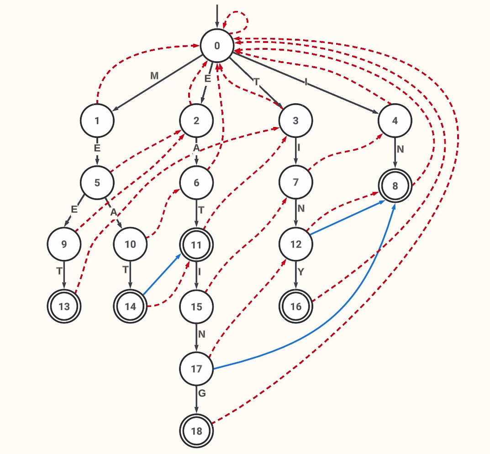

# Problema G

---

## 📌 Referências
- [📽️ Casamento de padrões por Aho-Corasick - PUC Minas](https://youtu.be/kKQLjWFf4nE)
- [📽️ Aho-Corasick Algorithm - ComputerBread](https://youtu.be/XWujo7KQL54)
- [📽️ Aho-Corasick implementation JavaScript - ComputerBread](https://youtu.be/jsgLCvOW6Vo)
- [📽️ Casamento de padrões por KMP - PUC Minas](https://youtu.be/yN1hZdjHS0o)
- [📽️ Sqrt Decomposition, Segment Tree - MIT](https://youtu.be/CFc_w5RfK6w)
- [📖 Efficient and easy segment trees - Codeforces](https://codeforces.com/blog/entry/18051)

## Exemplo Visual Trie

**Input**
```
MEET
MEAT
EAT
EATING
TINY
IN
```


>Esta árvore está com os nós numerados por profundidade, mas no nosso caso eles são numerados por ordem de inserção.
