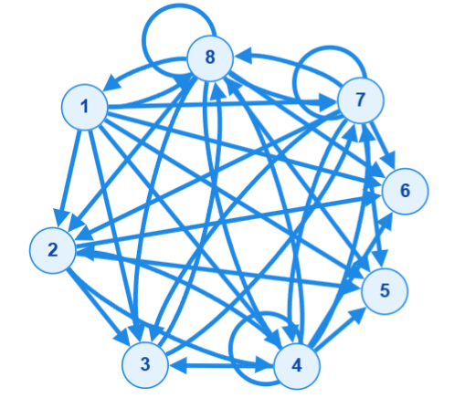
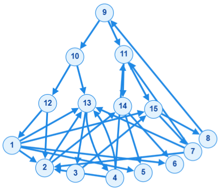

# Guia de Implementação e Algoritmos — Problema J

---

## 📌 Referências

- 📖 **Artigos e Documentações:**
  - [Dijkstra's Algorithm — Wikipedia](https://en.wikipedia.org/wiki/Dijkstra%27s_algorithm)
  - [Segment Tree em Problemas de Grafos — Codeforces](https://codeforces.com/blog/entry/135761)
  - [Convex Hull Trick & Li Chao Tree Notes — LeetCode](https://leetcode.com/discuss/post/6618678/convex-hull-trick-li-chao-tree-notes-by-l4jyd/)
  - [A Simple Introduction to Li-Chao Segment Tree — Robert's Blog](https://robert1003.github.io/2020/02/06/li-chao-segment-tree.html)
  - [Problema J — Codeforces Gym](https://codeforces.com/gym/106679/problem/J)

- 🎥 **Vídeos Explicativos:**
  - [Vídeo explicativo: Dijkstra](https://youtu.be/EFg3u_E6eHU)
  - [Vídeo explicativo: Segment Tree](https://youtu.be/-dUiRtJ8ot0)
  - [Vídeo explicativo: Li Chao Tree](https://youtu.be/DknbfinVLLk)

---

## 1. Explicação do Código `dijkstra_segment_tree.cpp`

### O Problema da Abordagem Ingênua

Se tentarmos adicionar uma aresta direcionada de $U$ para cada nó individual no intervalo $[L, R]$, no pior caso (onde cada intervalo cobre quase todo o grafo), teremos até $\mathcal{O}(N)$ arestas por consulta. 

Para $M$ conexões, isso geraria um grafo com até $\mathcal{O}(N \cdot M)$ arestas. Como $N, M \le 10^5$, rodar o algoritmo de Dijkstra em um grafo desse tamanho resultaria em **Time Limit Exceeded (TLE)** de forma imediata.

---

### A Solução: Nós Virtuais e Segment Tree de "Descida"

Para evitar criar tantas arestas, podemos utilizar uma **Segment Tree** não para fazer consultas de intervalos comuns, mas para **agrupar vértices e compartilhar arestas**.

#### 1. Construindo a Árvore de Descida (*Downwards Segment Tree*)

Imagine uma Segment Tree padrão sobre os nós originais de $1$ a $N$:
* **Nós Folha:** Representam os nós reais do problema ($1$ a $N$).
* **Nós Internos:** Representam intervalos agrupados (por exemplo, um nó que cobre $[5, 8]$).

Para conectar esses nós virtuais de volta aos nós reais, adicionamos arestas direcionadas do pai para os filhos com **peso $0$**:
* O nó raiz da árvore tem arestas de peso $0$ para seus dois filhos.
* Essa estrutura se repete até as folhas, que por sua vez possuem uma aresta de peso $0$ para os nós reais correspondentes do grafo.

Graças a essas conexões de custo $0$, qualquer caminho que chegue a um nó interno da Segment Tree pode "descer" de graça até alcançar as folhas reais daquele intervalo:

```text
               [5, 8] (Nó Virtual)
              /      \   (Arestas de peso 0)
          [5, 6]     [7, 8] (Nós Virtuais)
          /   \       /   \ (Arestas de peso 0)
         1     2     3     4 (Nós Reais)
```

#### 2. Adicionando uma Aresta de Intervalo ($U \to [L, R]$ com custo $X$)

Quando queremos conectar o nó $U$ a todas as empresas no intervalo $[L, R]$ com custo $X$:

1. Fazemos uma busca padrão na Segment Tree pelo intervalo $[L, R]$.
2. Essa busca decompõe o intervalo $[L, R]$ em no máximo $\mathcal{O}(\log N)$ **nós canônicos**.
3. Em vez de conectar $U$ a todos os nós individuais, criamos uma aresta direcionada de $U$ para cada um desses $\mathcal{O}(\log N)$ nós canônicos com custo $X$.

**Exemplo Prático:**
Para conectar o nó $1 \to [2, 4]$ com custo $10$, a Segment Tree decompõe o intervalo em $[2, 3]$ e $[4]$. Criamos apenas **duas** arestas virtuais:

* $1 \to [2, 3]$ com custo $10$
* $1 \to [4]$ com custo $10$

Através da descida de custo $0$, o Dijkstra conseguirá alcançar os nós reais $2$, $3$ e $4$ pagando exatamente o custo $10$.

#### 3. Executando o Dijkstra

Com o grafo expandido montado (contendo os $N$ nós reais $+$ aproximadamente $3N$ nós virtuais da Segment Tree), executamos o algoritmo de Dijkstra tradicional a partir da origem.

* **Número de Vértices ($V'$):** $N_{\text{reais}} + 3N_{\text{virtuais}} \approx 4N$
* **Número de Arestas ($E'$):** $\mathcal{O}(N)$ arestas de descida $+$ $\mathcal{O}(M \log N)$ arestas de intervalos
* **Complexidade de Tempo:** $\mathcal{O}(E' \log V')$, o que resulta em $\mathcal{O}((N + M \log N) \log N)$, executando em menos de 0.1s para $N = 10^5$.

### Exemplo
**input**
```
8 7 7 8
1 2 5 100 0
1 6 8 20 0
2 3 6 1 0
3 7 8 1 0
4 2 8 1 0
7 2 8 5 0
8 1 8 2 0
```

**Grafo gerado por `dijkstra_comum.cpp` (35 arrestas)**


**Grafo gerado por `dijkstra_segment_tree.cpp` (29 arrestas)**


---

## 2. Explicação do Código `dijkstra_li_chao_tree.cpp`

### Integração da Li Chao Tree no Algoritmo de Dijkstra

Para permitir valores de $K$ diferentes de zero no **Problema J**, o custo das conexões deixa de ser constante e passa a se comportar como uma **função afim** (uma reta).

A integração da **Li Chao Tree** no algoritmo de **Dijkstra** é um dos padrões mais avançados de programação competitiva. Ela substitui o vetor clássico de distâncias (`dist`) e a `priority_queue` tradicional por uma única estrutura unificada que gerencia tanto a inserção de caminhos quanto a busca pelo próximo nó de custo mínimo.

Abaixo, explicamos conceitualmente como essa integração funciona e como estruturar o código.

---

### 1. O Conceito: Como o Dijkstra "conversa" com a Li Chao Tree

Durante a execução do Dijkstra, quando retiramos uma empresa $U$ com distância já finalizada ($dist[U]$), precisamos relaxar todas as suas linhas telefônicas de saída.

Se uma linha vai de $U$ para o intervalo $[L, R]$ com custo base $X$ e incremento linear $K$:

O custo para alcançar qualquer empresa $v \in [L, R]$ passando por $U$ é:

$$\text{Custo}(v) = dist[U] + X + (v - L) \times K$$

Podemos reorganizar isso como uma reta $y = m \cdot v + b$ válida apenas no intervalo $[L, R]$:

$$\text{Custo}(v) = K \cdot v + (dist[U] + X - K \cdot L)$$

Onde:

* **Coeficiente angular ($m$):** $K$
* **Coeficiente linear ($b$):** $dist[U] + X - K \cdot L$

Em vez de atualizar cada empresa individualmente, inserimos esse segmento de reta $[L, R]$ diretamente na nossa **Li Chao Tree**. A Li Chao Tree se encarregará de atualizar implicitamente a distância mínima de todos os nós cobertos.

---

### 2. O Grande Desafio: Como achar o menor nó *unprocessed*?

No Dijkstra tradicional, usamos uma `priority_queue` para extrair o nó com a menor distância que ainda não foi processado. Se usamos uma Li Chao Tree para guardar as retas, como fazemos para extrair o próximo nó mínimo e marcar nós já processados como inativos?

#### A Solução Elegante: Rastreamento de Folhas Ativas (*Active Leaves*)

Qualquer reta $f(x) = m \cdot x + b$ é **estritamente monótona**. Isso significa que o valor mínimo de uma reta sobre qualquer subconjunto de pontos estará sempre em um dos **extremos ativos** (não processados) desse subconjunto!

Para cada nó $id$ que cobre o intervalo $[l, r]$ na Li Chao Tree, nós mantemos:

* `left_active`: O índice da folha ativa (não finalizada) mais à esquerda no intervalo $[l, r]$.
* `right_active`: O índice da folha ativa mais à direita no intervalo $[l, r]$.
* `tree_min`: O menor valor potencial de caminho para qualquer folha ativa contida na subárvore de $id$.

**Quando uma empresa $v$ é finalizada pelo Dijkstra:**

1. Nós a desativamos na base da Li Chao Tree (definindo suas folhas ativas como $-1$).
2. Atualizamos a árvore de baixo para cima.
3. Como $v$ agora é inativa, nenhuma reta de nenhum ancestral será avaliada em $v$ para o cálculo do mínimo. O valor de $v$ é efetivamente ignorado para sempre nas buscas por mínimos futuros!

---

### 3. Execução do Dijkstra no `main`

Com a árvore estruturada, o loop do Dijkstra simplifica-se a:

1. Consultar o custo mínimo global do sistema acessando `tree.tree_min`.
2. Se for `INF`, a busca terminou.
3. Caso contrário, encontrar qual empresa $U$ obteve esse valor usando `find_best_node(1, 1, N, tree.tree_min)`.
4. Processar as arestas de intervalo de $U$, inserindo as retas na árvore com `add_segment`.
5. Desativar $U$ chamando `deactivate(1, 1, N, u)` para que ele saia do conjunto ativo.

> **Complexidade Temporal:**
> O custo de cada inserção de segmento é de $\mathcal{O}(\log^2 N)$ e a extração do nó mínimo é de $\mathcal{O}(\log N)$, garantindo que o programa passe com folga no tempo limite.
